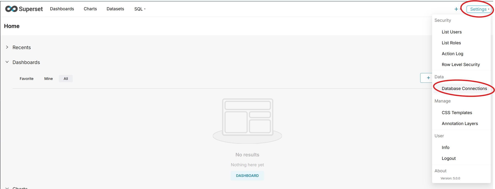
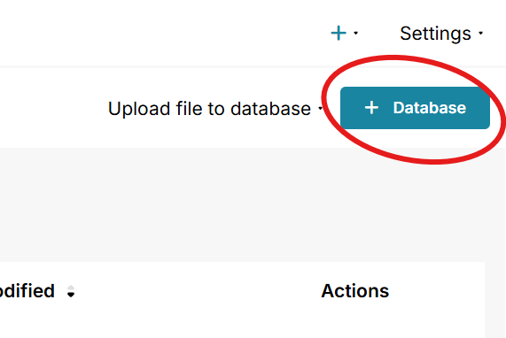
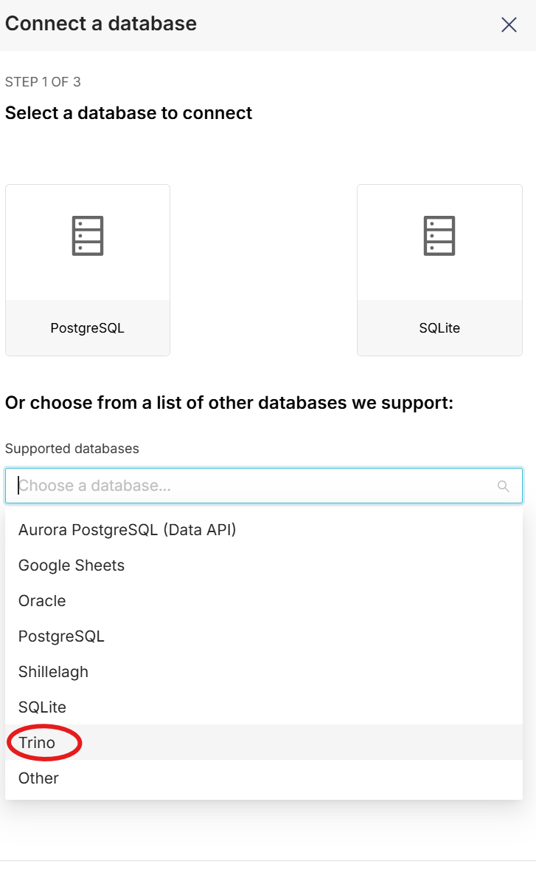
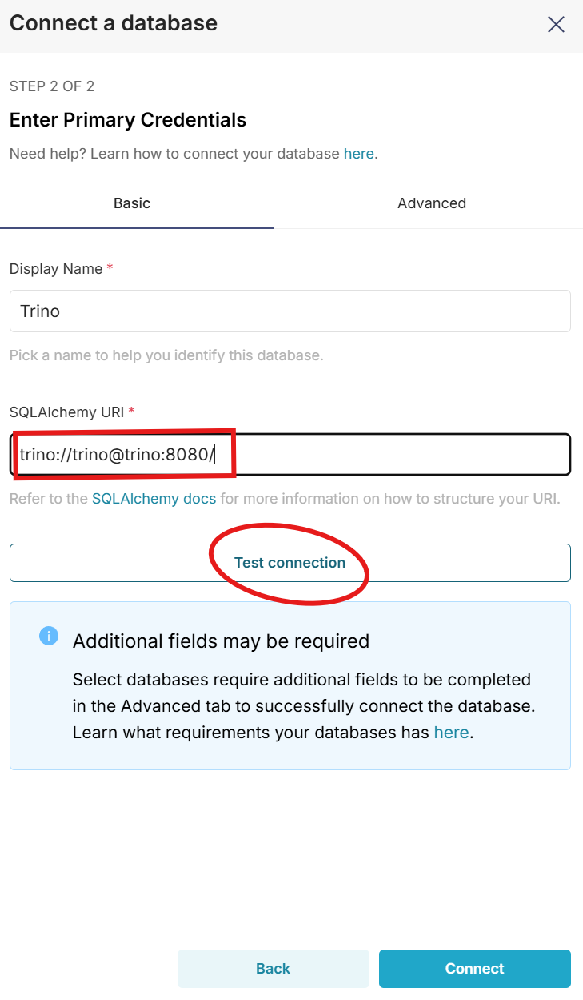

# midi-summer-school-analytics-on-fhir

## Getting started

```sh
# this automatically starts a Pathling server and kicks-off the resource $import.
# run this without `--file compose.synthea.yaml` to avoid re-downloading trino and synthea cli
USER_ID=$(id -u) GROUP_ID=$(id -g) docker compose --file compose.yaml --file compose.synthea.yaml --env-file=.demo.env up warehousekeeper --attach-dependencies --abort-on-container-failure
# after the import is done, we no longer need the Pathling server itself
docker compose --env-file=.demo.env stop pathling

# cleanup
docker compose --env-file=.demo.env down -v --remove-orphans
```

## Query the data

```sh
java -jar bin/trino.jar http://localhost:8080 --output-format=ALIGNED -f sql/table-counts.sql
```

## Superset

```sh
docker compose -f compose.superset.yaml up
```

Open <http://localhost:8088/> and login as `admin` with password `admin`.

### Connect to Trino

1. `Settings` -> `Database Connections`
   
1. `+ Database`
   
1. Under `Supported databases` select `Trino`
   
1. Copy and paste `trino://trino@trino:8080/` into the `SQLAlchemy URI` field. Click `Test connection`.
   
1. Click `Connect`

### Open SQL Lab

1. In the top-left hover over `SQL` and click `SQL Lab`
1. Copy and paste
   ```sql
   SELECT *
   FROM fhir.default.patient;
   ```
   And click `Run`.
