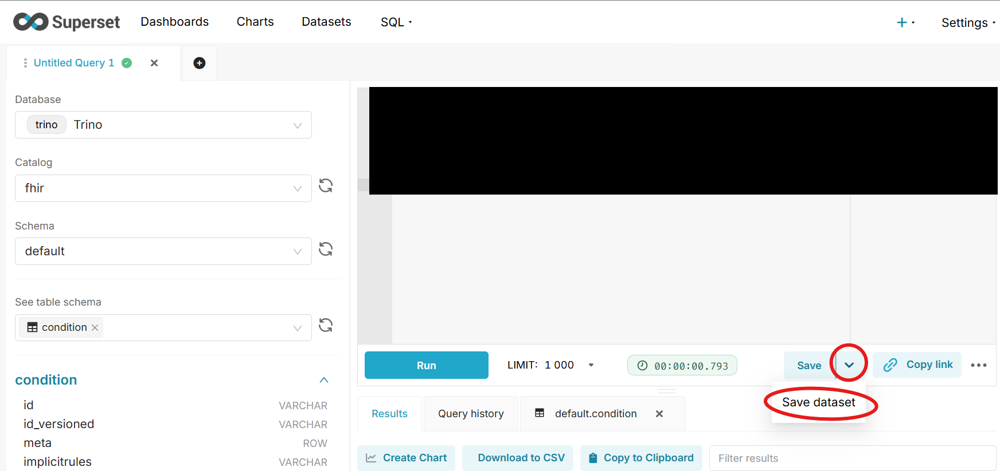
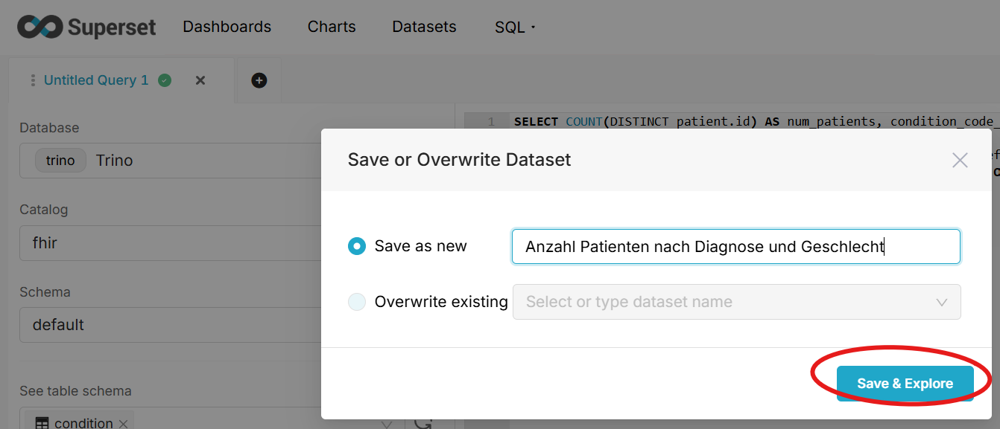
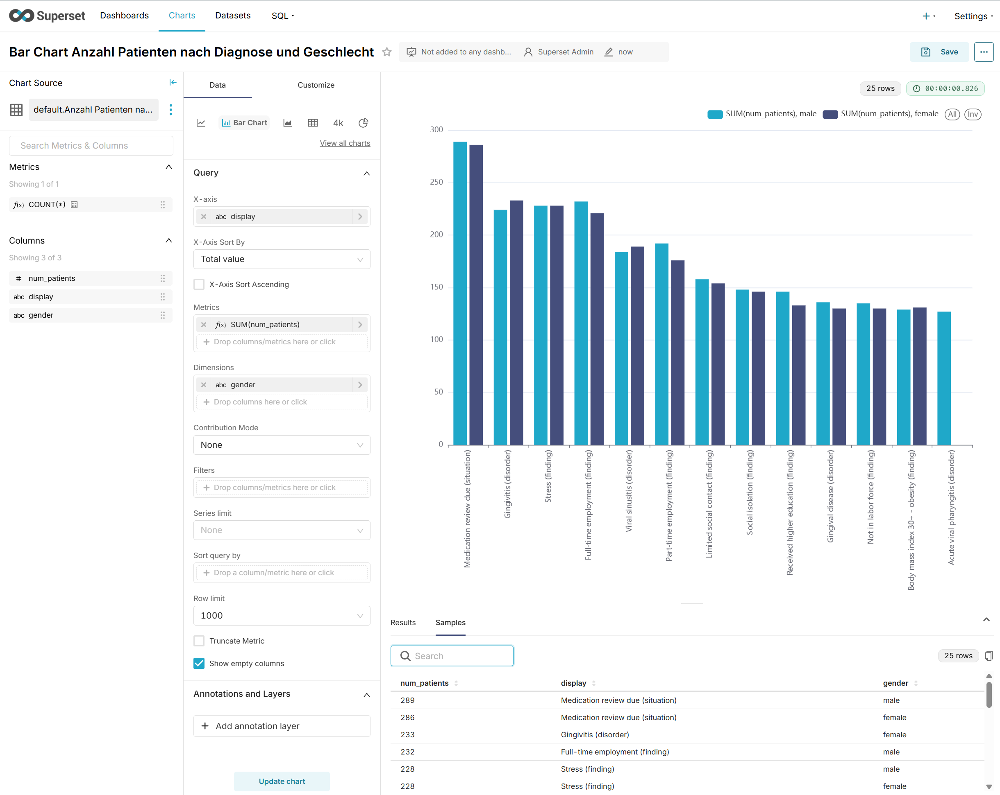

# Superset + Trino Übung

In SQL Lab, erstelle ein Query, dass die Anzahl der Patienten pro Diagnose, stratifiziert nach Geschlecht zurückgibt. Nur die 25 häufigsten Diagnosen sollen angezeigt werden.

Ist die Query fertig, kann sie als Plot visualisiert werden. Dazu müssen die Ergebnisse aus SQL Lab zunächst als Dataset gespeichert werden:

1. 
1. 

Nun kann der Plot zusammengeklickt werden:

